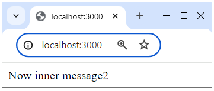
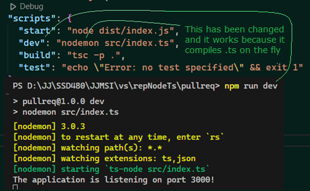

## About Node Express TypeScript starter

To write communication for Node Express in TypeScript, you need to properly configure 
the startup project, because simply converting the declarations and .js files to .ts is not enough.

For React applications, there is an easy way to create a ts application with the command: 
[npx create-react-app my-ts-app --template typescript].
There is probably no such easy way for Node, so you have to take the long way as below (or use this starter)

## Application development method

Node Express TypeScript starter:
- Create a project folder, e.g. [node_express_ts] and enter it (cd node_express_ts);
- Create the default project configuration [package.json file] with the command: [npm init -y];
- Add the Express framework and TypeScript language with the commands:

        npm install express 
        npm install typescript ts-node @types/node @types/express --save-dev

- Create the default TypeScript configuration [tsconfig.json file] with the command: [npx tsc --init];
- In the [tsconfig.json] file, uncomment and add:
        
        "rootDir": "./src",
        "outDir": "./dist",
        "moduleResolution": "node", // (or "node10")
- In the project, create folders: [/src], [/dist];
- In the [node_express_ts/src] folder, create the file [node_express_ts\src\index.ts] and enter:

        import express from 'express';
        const app = express();

        app.get('/', (req, res) => {
            res.send('Well done!');
        })

        app.listen(3000, () => {
            console.log(
                'The application is listening on port 3000!'
                );
        })

- In the [package.json] file, add:

        "scripts": {
            "start": "node dist/index.js",
            "dev": "node src/index.ts",
            "build": "tsc -p .",
        },

## Launching the application

- Make changes to the [node_express_ts\src\index.ts] file, e.g. change the message to: [res.send('Now inner message2');]
- Run the command: [npm run build]
- Run the command: [npm run start]
- Launch your browser with [http://localhost:3000/]

You will receive the entry [Now inner message2] in your browser. The [build] command compiled the file [node_express_ts\src\index.ts] to [node_express_ts\disc\index.js] (because the browser does not understand ts files). The [start] command (for production) launched this js file in the browser.
Each time you change [index.ts], you must run these two commands.

## Fast developer testing

The above startup is tedious. For the developer, there is a better way:
- When you don't have it, install [npm and nodemon]
- In the [package.json] file, change:
        
        ["dev": "node src/index.ts",] to 
        ["dev": "nodemon src/index.ts",]

- Run the application with the command: [npm run dev]

Now when you change the content of ts files - nodemon compiles them to temporary: js on the fly and exposes the project to the browser. You just need to refresh the browser and the changes will be visible. This route does not modify the js files in [node_express_ts\disc\]

## This project

This project was created after implementing the starting method described below and can be an application for further development.

Project written in Visual Studio Code;
